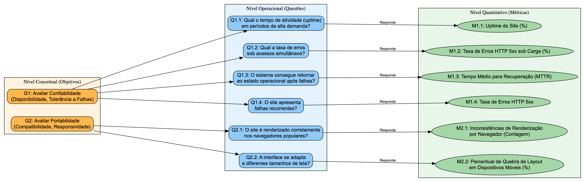

# Avaliação do Site Cebraspe — Fase 2

**Características analisadas:** Confiabilidade e Portabilidade  
**Base normativa:** ISO/IEC 25010 – SQuaRE  
**Produto:** Site do Cebraspe ([https://www.cebraspe.org.br/](https://www.cebraspe.org.br/))  
**Versão:** Atual (outubro de 2025)

---

## 1. Objetivos da Avaliação

Garantir a qualidade do site do CEBRASPE, com foco especial na **Confiabilidade** e **Portabilidade**, para assegurar que os candidatos a concursos tenham acesso ininterrupto e consistente às informações e serviços, independentemente do dispositivo ou navegador utilizado.  

Este objetivo estratégico visa fortalecer a credibilidade da instituição e a eficiência dos processos seletivos, minimizando riscos operacionais e melhorando a satisfação do usuário. A medição da qualidade do software é crucial para entender, controlar e melhorar o processo de desenvolvimento e o produto final.

| Característica | Objetivo |
|----------------|-----------|
| **Confiabilidade** | Avaliar a capacidade do site do Cebraspe de manter seu funcionamento correto e contínuo durante períodos de alta demanda, garantindo disponibilidade, tolerância a falhas e consistência de dados. |
| **Portabilidade** | Avaliar o grau em que o site pode ser utilizado em diferentes dispositivos, sistemas operacionais e navegadores, sem perda de funcionalidade ou usabilidade. |

---

## 2. Objetivos de Medição: Questões de Avaliação e Métricas

Os objetivos de medição são definidos para abordar o objetivo de negócio sob diferentes perspectivas, transformando-o em questões mensuráveis.  
Eles seguem a estrutura do **GQM (Goal Question Metric)**, que busca entender o processo e o produto de software para fornecer informações significativas para melhorias.

As **questões** orientam a investigação e as **métricas** quantificam o desempenho observado.  
Cada questão abaixo está associada a um ou mais **subatributos** da ISO/IEC 25010.

### 2.1. Confiabilidade

| Elemento | Descrição |
|-----------|------------|
| **Analisar** | Site do Cebraspe |
| **Para o propósito de** | Avaliar a consistência e a disponibilidade do sistema em momentos de alta demanda |
| **Com respeito a** | Confiabilidade |
| **Do ponto de vista de** | Candidatos a concursos (usuários finais) e equipe de desenvolvimento |
| **No contexto da** | Disciplina de Qualidade de Software |

#### 2.1.1. Perguntas e Hipóteses de Medição

| Questão | Hipótese Associada |
|----------|--------------------|
| **Q1:** Qual o tempo de atividade (uptime) do site durante períodos de alta demanda, como na publicação de editais e resultados? | **H1.1:** O tempo de atividade (uptime) do site será inferior a 99,5% durante as semanas de maior acesso, indicando potenciais falhas de disponibilidade que afetam a experiência do usuário. |
| **Q2:** Qual a taxa de erros do site ao lidar com um grande volume de acessos simultâneos? | **H2.1:** Testes de carga revelarão um aumento significativo na taxa de erros (respostas HTTP 5xx) para mais de 0,5% quando o número de usuários simultâneos ultrapassar 80% da capacidade projetada do servidor. |
| **Q3:** O sistema consegue retornar ao estado operacional após falhas ou interrupções? | **H3.1:** O tempo médio para recuperação (MTTR) do sistema após uma falha crítica excederá 30 minutos, resultando em um período prolongado de indisponibilidade para os usuários.
| **Q4:** O site apresenta falhas recorrentes ou instabilidades? | **H6.1:** A taxa de erros (ex.: HTTP 5xx) do site excederá 0,1% do total de requisições em uma semana, indicando instabilidades recorrentes que afetam a experiência do usuário.

#### 2.1.2. Seleção das Métricas

| Métrica | Descrição |
|----------|------------|
| **M1: Uptime do Site (%)** | Percentual de tempo em que o site esteve operacional e acessível. |
| **M2: Taxa de Erros HTTP 5xx sob Carga (%)** | Proporção de requisições que resultam em erros de servidor durante testes de carga. |
| **M3:** Tempo Médio para Recuperação (MTTR)|	Tempo médio necessário para restaurar o sistema à operação normal após uma falha ou interrupção, considerando o período desde a detecção até a resolução completa.
| **M4:** Taxa de Erros HTTP 5xx	| Percentual de requisições que resultam em erros do lado do servidor (códigos HTTP 5xx) em relação ao total de requisições, indicando instabilidade ou falhas internas.

---

### 2.2. Portabilidade

| Elemento | Descrição |
|-----------|------------|
| **Analisar** | Site do Cebraspe |
| **Para o propósito de** | Verificar a compatibilidade e a responsividade do site em diferentes plataformas e ambientes de execução |
| **Com respeito a** | Portabilidade (a facilidade com que o software pode ser transferido de um ambiente para outro) |
| **Do ponto de vista de** | Usuários finais com diferentes dispositivos e navegadores, e equipe de desenvolvimento |
| **No contexto da** | Disciplina de Qualidade de Software |

#### 2.2.1. Perguntas e Hipóteses de Medição

| Questão | Hipótese Associada |
|----------|--------------------|
| **Q1:** O site é renderizado corretamente nos navegadores mais populares? | **H1.1:** A análise de compatibilidade visual e funcional revelará inconsistências de layout ou funcionalidades quebradas em pelo menos dois dos navegadores secundários em comparação com o Chrome. |
| **Q2:** A interface do site se adapta de forma responsiva a diferentes tamanhos de tela? | **H2.1:** A avaliação da responsividade mostrará que elementos da interface se sobrepõem, são cortados ou se tornam inacessíveis em telas de smartphones, especialmente em modo paisagem. |

#### 2.2.2. Seleção das Métricas

| Métrica | Descrição |
|----------|------------|
| **M1: Inconsistências de Renderização por Navegador** | Contagem de problemas visuais ou funcionais detectados em cada navegador testado. |
| **M2: Percentual de Quebra de Layout em Dispositivos Móveis (%)** | Proporção de telas ou componentes com falhas de layout em dispositivos móveis. |

---

## 3. Folha de Abstração 

| Elemento | Descrição |
|-----------|------------|
| **Objeto de Estudo** | Site do CEBRASPE (aplicação web) |
| **Propósito** | Avaliar e melhorar a confiabilidade e portabilidade do site para garantir acessibilidade e boa experiência do usuário. |
| **Ponto de Vista** | **Organizacional:** CEBRASPE (garantir credibilidade e eficiência).  **Usuário Final:** Candidatos a concursos (acesso ininterrupto e consistente).   **Desenvolvedor:** Equipe de desenvolvimento (identificar áreas de melhoria no código e na infraestrutura). |
| **Foco da Qualidade** | Confiabilidade (disponibilidade e resiliência a picos de carga)   Portabilidade (compatibilidade e responsividade) |
| **Hipóteses de Referência** | O tempo de atividade do site será inferior a 99,5% em picos de demanda, impactando a experiência do usuário.   A taxa de erros (HTTP 5xx) excederá 0,5% em testes de carga com mais de 80% da capacidade do servidor.    Inconsistências de layout e funcionalidades quebradas serão observadas em pelo menos dois navegadores secundários. |
| **Fatores de Variação** | **Volume de tráfego:** Flutuações inesperadas devido a eventos específicos (lançamento de edital, resultados).   **Atualizações de software:** Novas versões de navegadores, sistemas operacionais ou bibliotecas de desenvolvimento.   **Infraestrutura:** Mudanças na configuração de servidores, balanceadores de carga ou rede.     **Complexidade do conteúdo:** Páginas com maior dinamismo ou elementos multimídia |
| **Impacto dos Fatores de Variação** | **Volume de tráfego inesperado:** Pode sobrecarregar o servidor, aumentando a taxa de erros e diminuindo o uptime.   **Atualizações de navegadores:** Podem introduzir novas inconsistências de renderização ou afetar a responsividade.    **Mudanças na infraestrutura do servidor:** Podem impactar diretamente a disponibilidade e o desempenho geral do site.    **Complexidade das páginas:** Pode aumentar a probabilidade de quebras de layout e exigir mais recursos do navegador, afetando a experiência em dispositivos menos potentes. |

---
## 4. Critérios de Aceitação

| Característica | Métrica Crítica | Valor de Referência | Nível de Aceitação |
|----------------|-----------------|------------------|------------------|
| **Confiabilidade** | Disponibilidade | ≥ 99,5% | Aceitável |
| **Confiabilidade** | Tempo médio de resposta | ≤ 3s | Aceitável |
| **Confiabilidade** | Taxa de erro | ≤ 1% | Aceitável |
| **Portabilidade** | Compatibilidade entre navegadores | ≥ 90% | Aceitável |
| **Portabilidade** | Pontuação Lighthouse (Mobile) | ≥ 80 | Aceitável |
| **Portabilidade** | Responsividade de layout | 100% das páginas principais | Aceitável |

## 5. Considerações Metodológicas

**Ferramentas:**

- Lighthouse (Chrome DevTools): avaliação automática de desempenho, acessibilidade, responsividade e compatibilidade  
- Pingdom / UptimeRobot: monitoramento de disponibilidade (uptime, tempo de resposta)  
- GTmetrix: análise de tempo de carregamento e estabilidade sob carga  
- BrowserStack: teste de compatibilidade entre navegadores e sistemas  
- WAVE / AXE: validação de acessibilidade  

**Amostra de Páginas Testadas:**

- Página inicial  
- Página de concursos em andamento  
- Página de detalhes de um concurso  
- Página institucional (“Sobre o Cebraspe”)  

**Período de Coleta:** 5 dias úteis (horários de pico e fora de pico)

---

## 6. Interpretação dos Resultados

- **Alta confiabilidade** será demonstrada se o site mantiver alta disponibilidade, baixo tempo de resposta e mínima ocorrência de falhas.  
- **Alta portabilidade** será observada se o site mantiver desempenho e aparência consistentes em diferentes plataformas e dispositivos.  
- Eventuais falhas (ex.: incompatibilidade com Safari iOS ou travamentos sob carga) deverão ser documentadas com **capturas de tela e logs** para subsidiar recomendações de melhoria.

---

## 7. Diagrama GQM

## Referências Bibliográficas

**FENTON, Norman; BIEMAN, James.** *Software Metrics: A Rigorous and Practical Approach.* 3. ed. Boca Raton: CRC Press, 2015. Acesso em: 12 out. 2025.

**BASILI, Victor R. et al.** *Linking Software Development and Business Strategy through Measurement.* *Computer*, v. 43, n. 4, p. 57–65, abr. 2010. Acesso em: 12 out. 2025.

## Tabela de Contribuição 

|  Matrícula |  Nome  |  Contribuição (%) |
|-------------|------------------|---------------------|
| 222006632 | [Daniel Ferreira](https://github.com/DanielFsR) | 16,7 |
| 200017772 | [Fellipe Silva](https://github.com/fellipepcs) | 16,7 |
| 222006801 | [Henrique Carvalho](https://github.com/henriquecarv3) | 16,7 |
| 222006893 | [Kaio Macedo](https://github.com/bigkaio) | 16,7 |
| 221008329 | [Maria Clara](https://github.com/alvezclari) | 16,7 |
| 221037975 | [Natalia Rodrigues](https://github.com/Natyrodrigues) | 16,7 |

## Histórico de Versões

| Versão | Descrição | Responsável | Data  | Revisor(es) | Detalhes da Revisão | Data da revisão |
| :----: | --------- | --------- | :--------------: | ----------- | :-------------: | :-------------: |
| `1.0` | documentação inicial e estrutura geral | [Natalia](https://github.com/Natyrodrigues) | 12/10/2025| [Maria Clara ](https://github.com/alvezclari)    |  | 12/10/2025 |
| `1.1` | acrescenta informções em cada tópico, folha de abstração e complementa conteúdo em **Objetivos de Medição: Questões de Avaliação e Métricas** | [Maria Clara](https://github.com/alvezclari) | 12/10/2025 |  | | |
| `1.2` | adiciona referências e tabela de contribuição | [Henrique Carvalho](https://github.com/henriquecarv3) | 12/10/2025 |  | | |
| `1.3` | correções gerais | [Maria Clara](https://github.com/alvezclari) | 22/10/2025|    |  |  |

