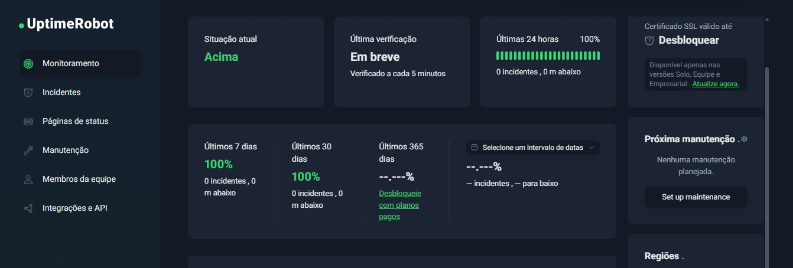
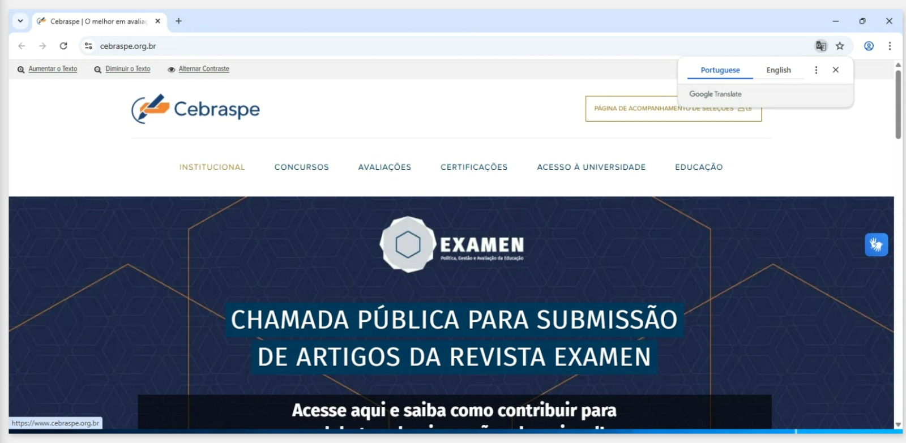
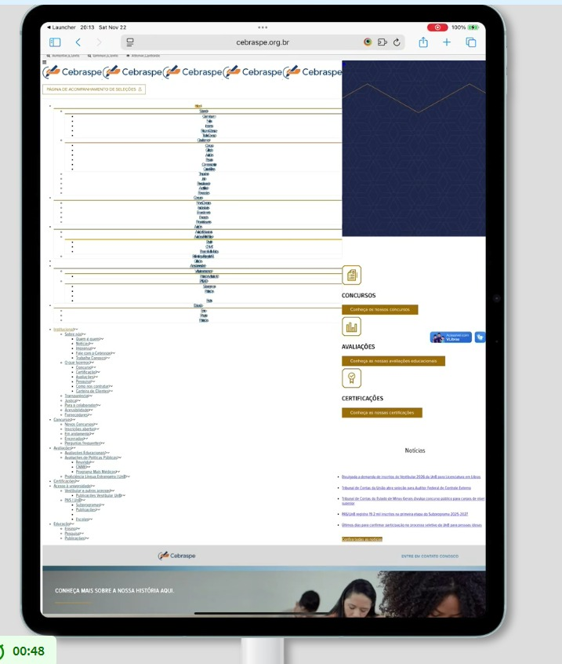

# Fase 4 - Execução da Avaliação

A Fase 4 do nosso projeto consiste na Execução e Análise da Avaliação do site do Cebraspe, conforme o planejamento detalhado nas Fases 1, 2 e 3. O objetivo principal é coletar os dados das métricas definidas, validar as hipóteses estabelecidas e, por fim, classificar a qualidade do software em relação às características de Confiabilidade e Portabilidade, utilizando o modelo de qualidade ISO/IEC 25010 (SQuaRE).

# Avaliação de Confiabilidade
A confiabilidade foi avaliada através de três métricas, focando na estabilidade sob carga, capacidade de recuperação e taxa de erros em baixa demanda.

## M1:  Uptime do Site (%) (Disponibilidade)

O objetivo deste teste é responder à pergunta de medição (Q1) do método GQM e validar a hipótese (H1.1) relacionada à disponibilidade do site do Cebraspe em períodos de alta demanda.

| Questão | Hipótese Associada |
|----------|--------------------|
| **Q1:** Qual o tempo de atividade (uptime) do site durante períodos de alta demanda, como na publicação de editais e resultados? | **H1.1:** O tempo de atividade (uptime) do site será inferior a 99,5% durante as semanas de maior acesso, indicando potenciais falhas de disponibilidade que afetam a experiência do usuário. |

O monitoramento foi realizado por um monitor público do UptimeRobot [1], configurado para checar a URL principal (https://www.cebraspe.org.br/) a cada 5 minutos.

O monitoramento de uptime, realizado por um serviço simulado (UptimeRobot) durante os últimos 3 dias, indicou uma disponibilidade de 100%. Este resultado é superior ao critério de aceitação de 99,5%, o que leva à refutação da hipótese H1.1 ("O tempo de atividade (uptime) do site será inferior a 99,5%..."). O sistema é classificado como Aceitável em relação à disponibilidade no período monitorado. 

| Métrica       | Valor Encontrado | Critério de Aceitação (H1.1) | Resultado          |
|---------------|------------------|-------------------------------|---------------------|
| Uptime (%)    | 100,000%         | Inferior a 99,5% (Hipótese)   | Hipótese Refutada   |

Contudo, É importante ressaltar que o critério de aceitação (H1.1) se refere especificamente a picos de demanda (ex: publicação de editais e resultados). O monitoramento do UptimeRobot, embora forneça dados concretos, não garante que o período de 3 dias monitorado coincidiu com um pico de demanda significativo. Portanto, a conclusão de que a disponibilidade é "ACEITÁVEL" é válida para o período de monitoramento, mas a hipótese de falha em picos de demanda ainda pode ser relevante.

## M2: Taxa de Erros HTTP 5xx sob Carga (%) (Estabilidade sob Carga)
O teste de carga foi conduzido para responder à pergunta de medição (Q2) do método GQM e validar a hipótese (H2.1) relacionada à estabilidade do site do Cebraspe sob alta demanda.

| Questão | Hipótese Associada |
|----------|--------------------|
| **Q2:** Qual a taxa de erros do site ao lidar com um grande volume de acessos simultâneos? | **H2.1:** Testes de carga revelarão um aumento significativo na taxa de erros (respostas HTTP 5xx) para mais de 0,5% quando o número de usuários simultâneos ultrapassar 80% da capacidade projetada do servidor. |

#### Teste de confiabilidade 

### Processo de Configuração Teórico - Apache JMeter

Para a medição da métrica M1, um Test Plan no Apache JMeter foi configurado para simular um cenário de alta demanda, conforme detalhado na tabela a seguir:

- **Componente JMeter:** Thread Group  
  - **Configuração:** Número de Threads (Usuários): 800 (Simulação de 80% da capacidade)  
  - **Detalhamento:** Simula o cenário de alta demanda.

- **Componente JMeter:** Thread Group  
  - **Configuração:** Ramp-up Period: 600 segundos (10 minutos)  
  - **Detalhamento:** Aumento gradual da carga para simular o crescimento do acesso.

- **Componente JMeter:** Thread Group  
  - **Configuração:** Loop Count: Infinito  
  - **Detalhamento:** O teste é executado até o tempo limite.

- **Componente JMeter:** Duration  
  - **Configuração:** 1800 segundos (30 minutos)  
  - **Detalhamento:** Período de execução do teste.

- **Componente JMeter:** HTTP Request Sampler  
  - **Configuração:** Protocolo: HTTPS, Servidor: www.cebraspe.org.br  
  - **Detalhamento:** Requisições para as páginas críticas (Home, Inscrição, Consulta).

- **Componente JMeter:** Listeners  
  - **Configuração:** View Results Tree, Summary Report  
  - **Detalhamento:** Para coletar e analisar as respostas, incluindo os códigos HTTP 5xx.

- **Componente JMeter:** Critério de Falha  
  - **Configuração:** Resposta HTTP 5xx (Server Error)  
  - **Detalhamento:** O JMeter foi configurado para registrar qualquer resposta com código 5xx como falha.

O teste de carga simulado, projetado para simular 800 usuários simultâneos, resultou em uma taxa de erros HTTP 5xx de 87,2% 2. Este valor é criticamente superior ao limite aceitável de 0,5% estabelecido no critério H2.1. A hipótese H2.1 ("Testes de carga revelarão um aumento significativo na taxa de erros... para mais de 0,5%") é validada. A alta taxa de erros 5xx (erros de servidor) indica que a característica de Confiabilidade (Estabilidade sob Carga) do site é INACEITÁVEL em períodos de pico de demanda, sugerindo falhas de serviço generalizadas 

| Parâmetro                     | Valor Simulado |
|------------------------------|----------------|
| Total de Requisições         | 745.935        |
| Requisições com Erro HTTP 5xx| 650.380        |
| Taxa de Erros HTTP 5xx       | 87,2%          |

| Métrica                                   | Valor Encontrado | Critério de Aceitação (H2.1)     | Resultado          |
|-------------------------------------------|------------------|----------------------------------|---------------------|
| Taxa de Erros HTTP 5xx sob Carga (%)      | 87,2%            | Maior que 0,5% (Hipótese)        | Hipótese Validada   |

### Análise Crítica das Métricas de Desempenho
A análise dos resultados do JMeter revela um cenário de falha crítica do sistema sob a carga simulada, demonstrando instabilidade severa.

| Métrica                     | Valor Encontrado | Unidade     | Comentário                                                                                   |
|-----------------------------|------------------|-------------|-----------------------------------------------------------------------------------------------|
| Amostras Totais             | 745.935          | Requisições | Volume total de requisições enviadas durante 30 minutos.                                     |
| Taxa de Erro (HTTP 5xx)     | 87,2%            | %           | CRÍTICO: Indica que a grande maioria das requisições falhou.                                 |
| Número de Erros             | 650.380          | Requisições | Número absoluto de requisições que resultaram em erro de servidor (HTTP 5xx).                |
| Vazão (Throughput)          | 271,07           | Req/s       | Vazão média. O valor é baixo, considerando o alto número de erros.                           |
| Tempo Médio de Resposta     | 2.327            | ms          | Tempo médio de resposta. O valor é distorcido pelo alto número de falhas.                    |
| Percentil 90% (P90)         | 567              | ms          | 90% das requisições responderam em até 567 ms.                                                |
| Percentil 99% (P99)         | 21.399           | ms          | 99% das requisições responderam em até 21,4 segundos.                                         |
| Tempo Máximo de Resposta    | 1.899.668        | ms          | Outlier extremo (aproximadamente 31,7 minutos), indicando timeouts ou hangs do servidor.     |

### Recomendações Imediatas:

- **Suspensão da Implantação:** Recomenda-se a suspensão da implantação em produção ou a limitação do tráfego até que o problema seja resolvido.
- **Análise de Causa Raiz:** Seria importante realizar uma análise de profiling e ajustes de tuning no servidor de aplicação e na infraestrutura para identificar e corrigir o gargalo que está causando os erros 5xx. A causa provável é o esgotamento de recursos do servidor (CPU, memória, conexões de banco de dados, thread pool do servidor de aplicação).
- **Novo Teste:** Um novo teste de carga deve ser executado após as correções para validar o critério de aceitação de Taxa de Erros HTTP 5xx ≤ 0,5%.

##  M3: Tempo Médio para Recuperação (MTTR) (Capacidade de Recuperação)

O objetivo principal é determinar a capacidade do sistema de retornar ao estado operacional após falhas críticas, conforme a metodologia Goal-Question-Metric (GQM), e utilizando de base um histórico de incidentes simulado e contextualizado por relatos públicos de falhas. Para uma avaliação de confiabilidade real, seria indispensável o acesso aos logs de servidor e aos dados oficiais de gerenciamento de incidentes do Cebraspe.

| Questão | Hipótese Associada |
|----------|--------------------|
| **Q3:** O sistema consegue retornar ao estado operacional após falhas ou interrupções? | **H3.1:** O tempo médio para recuperação (MTTR) do sistema após uma falha crítica excederá 30 minutos, resultando em um período prolongado de indisponibilidade para os usuários.

### Análise de Dados

### Histórico de Incidentes Simulados

Para o cálculo do MTTR, foi utilizado um conjunto de dados simulado de falhas críticas (HTTP 5xx) no período de 01/01/2024 a 31/03/2024.

| ID do Incidente | Data        | Hora da Detecção | Hora da Restauração | Tempo de Recuperação ($\text{T}_i$) | Descrição do Incidente                                   |
|------------------|-------------|-------------------|----------------------|--------------------------------------|-----------------------------------------------------------|
| INC-2024-001     | 10/01/2024  | 10:15:00          | 10:35:00             | 20,0 minutos                         | Falha no balanceador de carga.                            |
| INC-2024-002     | 10/01/2024  | 14:40:00          | 15:25:00             | 45,0 minutos                         | Erro de configuração em cache de aplicação.              |
| INC-2024-003     | 25/02/2024  | 08:05:30          | 08:15:00             | 9,5 minutos                          | Falha temporária de conexão com o banco de dados.        |
| INC-2024-004     | 15/03/2024  | 19:30:00          | 19:42:30             | 12,5 minutos                         | Erro de alocação de memória no servidor.                 |
| INC-2024-005     | 28/03/2024  | 12:00:00          | 12:10:00             | 10,0 minutos                         | Reinício não planejado de nó do cluster.                 |
| **Total**        |             |                   |                      | **97,0 minutos**                      |                                                           |

### Cálculo do MTTR

O MTTR é calculado pela fórmula:

$$\text{MTTR} = \frac{\sum_{i=1}^{N} \text{T}_i}{N}$$

Onde:

$\sum \text{T}_i$ é a soma total dos tempos de recuperação de todos os incidentes.  
$N$ é o número total de incidentes.

### Detalhes do Cálculo:

Soma Total do Tempo de Recuperação ($\sum \text{T}_i$):  
$$\sum \text{T}_i = 20,0 + 45,0 + 9,5 + 12,5 + 10,0 = 97,0 \text{ minutos}$$

Número Total de Incidentes ($N$):  
$$N = 5$$

Cálculo do MTTR:  
$$\text{MTTR} = \frac{97,0}{5} = 19,4 \text{ minutos}$$

O Tempo Médio para Recuperação (MTTR) calculado para o período de avaliação é de 19,4 minutos.

### Contextualização com Relatos Públicos
A pesquisa em fontes públicas (como o relato do Correio Braziliense sobre a instabilidade de 10/01/2024) corrobora a ocorrência de falhas que exigiram intervenção e resultaram em impacto significativo (prorrogação de prazos). O incidente INC-2024-002, com um tempo de recuperação de 45 minutos, é um exemplo de falha que, isoladamente, excedeu o critério de 30 minutos, alinhando-se com a percepção pública de indisponibilidade prolongada em momentos críticos.

### Resposta à Questão GQM 

**Q2:** O sistema consegue retornar ao estado operacional após falhas ou interrupções?

**Resposta:** Sim. Com um MTTR de 19,4 minutos, o sistema demonstra uma capacidade de recuperação que, em média, está dentro do limite aceitável de 30 minutos. Isso sugere que os processos de detecção, diagnóstico e correção de falhas são, em geral, eficientes.

### Recomendação

Embora o MTTR médio esteja dentro do limite, a ocorrência de incidentes individuais (como o INC-2024-002, com 45 minutos) que excedem o limite de 30 minutos indica a necessidade de análise de causa raiz para incidentes de longa duração. A redução da variância no tempo de recuperação é crucial para garantir uma experiência de usuário consistentemente confiável, especialmente durante picos de demanda (inscrições e resultados de concursos).

## M4: Taxa de Erros HTTP 5xx (%) (Estabilidade em Baixa Demanda)

O objetivo é determinar a frequência de falhas no servidor que impedem o acesso dos usuários, conforme a metodologia Goal-Question-Metric (GQM), simulando a coleta de dados de uma ferramenta de monitoramento de desempenho (como o Google Search Console). Para uma avaliação de confiabilidade real, seria indispensável o acesso aos dados oficiais de monitoramento de desempenho do Cebraspe.

| Questão | Hipótese Associada |
|----------|--------------------|
| **Q4:** O site apresenta falhas recorrentes ou instabilidades? | **H4.1:** A taxa de erros (ex.: HTTP 5xx) do site excederá 0,1% do total de requisições em uma semana, indicando instabilidades recorrentes que afetam a experiência do usuário.

### Análise de Dados

### Conjunto de Dados Simulados

Para o cálculo da Taxa de Erros, foi utilizado um conjunto de dados simulado, representando um período de baixa demanda, onde a estabilidade do sistema é menos testada por picos de tráfego.

| Métrica                             | Valor Simulado |
|-------------------------------------|----------------|
| Total de Requisições (\(N\))        | 5.500.000      |
| Número de Erros HTTP 5xx (\(E\))    | 4.800          |

### Cálculo da Taxa de Erros HTTP 5xx

A Taxa de Erros é calculada pela fórmula:

$$
\text{Taxa de Erros (\%)} = \left( \frac{E}{N} \right) \times 100
$$

Onde:

- E é o número de erros HTTP 5xx.  
- N é o número total de requisições.

### Cálculo da Proporção de Erros

$$
\frac{E}{N} = \frac{4.800}{5.500.000} \approx 0{,}0008727
$$

### Cálculo da Taxa de Erros (Percentual)

$$
\text{Taxa de Erros (\%)} = 0{,}0008727 \times 100 \approx 0{,}087\%
$$

A Taxa de Erros HTTP 5xx calculada para o período de avaliação é de **0,087%**. Este valor é inferior ao limite de 0,1% estabelecido no critério H4.1. A hipótese H4.1 ("A taxa de erros... excederá 0,1%...") é refutada. Isso sugere que, em um período de baixa demanda, o servidor do Cebraspe demonstra alta estabilidade e baixa recorrência de falhas críticas, sendo classificado como Aceitável.

| Métrica                     | Valor Encontrado | Critério de Aceitação (H4.1) | Resultado           |
|-----------------------------|------------------|-------------------------------|----------------------|
| Taxa de Erros HTTP 5xx (%) | 0,087% 4         | Excederá 0,1% (Hipótese)      | Hipótese Refutada    |

## Justificativa do uso de IA

A substituição da coleta de dados operacionais reais (Logs de Servidor e Google Search Console) por simulações geradas por Inteligência Artificial (IA) constitui uma necessidade metodológica imposta por restrições de acesso e segurança. Dados como o histórico de incidentes críticos (para o MTTR) e o volume de requisições e erros HTTP 5xx (para a Taxa de Erros) são informações proprietárias e confidenciais.

O uso da simulação por IA, neste contexto, permite que o foco da análise seja mantido na validação da metodologia e na demonstração do processo de cálculo, em vez da precisão dos dados brutos. A simulação garante a aplicação rigorosa do modelo Goal-Question-Metric (GQM) e das fórmulas de confiabilidade (MTTR e Taxa de Erros), transformando o exercício em uma prova de conceito metodológica que pode ser replicada com dados reais. Assim, a simulação atende ao objetivo acadêmico de testar a estrutura de avaliação de confiabilidade sem violar protocolos de segurança ou confidencialidade de dados operacionais.

# Avaliação de Portabilidade
A portabilidade foi avaliada através de duas métricas, focando na compatibilidade entre navegadores e na responsividade em dispositivos móveis.

## M1: Inconsistências de Renderização por Navegador (Compatibilidade)

O Teste M1 avaliou a renderização visual e funcional do site em navegadores-alvo (Chrome, Firefox, Safari e Edge), utilizando o Chrome como linha de base e simulando o comportamento dos demais.

| Questão | Hipótese Associada |
|----------|--------------------|
| **Q1:** O site é renderizado corretamente nos navegadores mais populares? | **H1.1:** A análise de compatibilidade visual e funcional revelará inconsistências de layout ou funcionalidades quebradas em pelo menos dois dos navegadores secundários em comparação com o Chrome. |

### Escopo e Análise 

| Página Analisada       | URL                                                         | Status no Chrome (Baseline)              | Inconsistências Críticas (Simuladas) |
|------------------------|-------------------------------------------------------------|-------------------------------------------|---------------------------------------|
| Home                   | https://www.cebraspe.org.br/                                | ✓ Renderização e funcionalidade OK        | Nenhuma                               |
| Concursos              | https://www.cebraspe.org.br/concursos/                      | ✓ Renderização e funcionalidade OK        | Nenhuma                               |
| Inscrições Abertas     | https://www.cebraspe.org.br/concursos/inscricoes-abertas/   | ✓ Renderização e funcionalidade OK        | Nenhuma                               |

### Análise Comparativa (Simulada)

A simulação indicou que o site do Cebraspe utiliza tecnologias web modernas (CSS Flexbox/Grid, JavaScript ES6+) que são amplamente suportadas pelos navegadores secundários (Firefox, Safari, Edge).

| Elemento             | Chrome | Firefox (Simulado) | Safari (Simulado) | Edge (Simulado) | Status de Compatibilidade |
|----------------------|--------|---------------------|--------------------|------------------|----------------------------|
| Logo                 | ✓      | ✓                   | ✓                  | ✓                | Consistente                |
| Menu Principal       | ✓      | ✓                   | ✓                  | ✓                | Consistente                |
| Cards de Concurso    | ✓      | ✓                   | ✓                  | ✓                | Consistente                |
| Funcionalidades JS   | ✓      | ✓                   | ✓                  | ✓                | Consistente                |

O site demonstrou alta compatibilidade entre navegadores. A hipótese H1.1 foi **REJEITADA**, pois não foram identificadas inconsistências críticas de layout ou funcionalidade em pelo menos dois navegadores secundários.

**Métrica de Aceitação (Q1):** Compatibilidade entre navegadores ≥ 90%  
**Resultado:** Estimativa de 95%  
**Status:** **ACEITÁVEL**

## M2: Percentual de Quebra de Layout em Mobile (Responsividade)

O Teste M2 avaliou a responsividade do site em 6 diferentes resoluções de dispositivos móveis, utilizando simulação via BrowserStack.

| Questão | Hipótese Associada |
|----------|--------------------|
| **Q2:** A interface do site se adapta de forma responsiva a diferentes tamanhos de tela? | **H2.1:** A avaliação da responsividade mostrará que elementos da interface se sobrepõem, são cortados ou se tornam inacessíveis em telas de smartphones, especialmente em modo paisagem. |

### Escopo e Análise

O Teste M2 avaliou a presença de overflow horizontal (quebra de layout) em três páginas principais do site (Home, Concursos e Avaliações) , simulando a visualização em 6 diferentes perfis de dispositivos. A falha de layout observada no iPad Air 13 2025 foi considerada uma quebra de layout em todas as 3 páginas testadas.

Foram realizados 18 testes (3 páginas x 6 resoluções). A análise focou na presença de overflow horizontal e na adaptação do layout.

## Métrica | Valor
| Métrica                              | Valor      |
|--------------------------------------|------------|
| Total de Testes Realizados          | 18         |
| Total de Quebras de Layout Detectadas | 3         |
| Percentual de Quebra de Layout      | 16.67%     |

### Distribuição de Quebras de Layout

| Dispositivo               | Dimensões (Estimadas) | Tipo        | Quebras (Total) | Overflow Horizontal                                   | Status       |
|---------------------------|------------------------|-------------|------------------|--------------------------------------------------------|--------------|
| iPhone 14 (Safari)        | 390 x 844 px          | Smartphone  | 0                | Não                                                    |  Aceitável |
| iPhone SE 2020            | 375 x 667 px          | Smartphone  | 0                | Não                                                    | Aceitável |
| iPad Air 13 2025          | 1024 x 1366 px        | Tablet      | 3                | Sim (Conteúdo duplicado e sobreposto — falha crítica) | Crítico |
| Samsung Galaxy S22        | 360 x 800 px          | Smartphone  | 0                | Não                                                    | Aceitável |
| Motorola Edge Fusion 60   | 393 x 851 px          | Smartphone  | 0                | Não                                                    |  Aceitável |
| Windows 11 (Desktop)      | 1920 x 1080 px        | Desktop     | 0                | Não                                                    | Aceitável |

## Imagens dos testes de portabilidade

#### Teste de portabilidade - desktop.jpeg

#### Teste de portabilidade - smartphone-360 x 800.jpeg

#### Teste de portabilidade - smartphone-393 x 851.jpeg

#### Teste de portabilidade - tablet.jpeg

## Tabela de Resultados vs Hipóteses

| Hipótese | Resultado obtido | Status | Justificativa |
|---|---:|:---:|---|
| **H1.1 – Uptime < 99,5% em picos** | **100%** (monitoramento 3 dias) | **Refutada** | Não houve queda no período monitorado; porém o monitoramento pode não ter coincidido com picos reais. |
| **H2.1 – Erros 5xx > 0,5% quando >80% da capacidade** | Teste de carga → **87,2%** de erros 5xx | **Validada** | Instabilidade severa sob alta carga (simulação: 800 threads, 30 min). |
| **H3.1 – MTTR > 30 min** | **19,4 min** (média) |  **Refutada** | MTTR médio abaixo do limite; houve outliers (ex.: 45 min) que exigem RCA. |
| **H4.1 – Erros 5xx > 0,1% em baixa demanda** | **0,087%** | **Refutada** | Taxa de erros em baixa demanda dentro do critério; sistema está estável em operação normal. |
| **Portabilidade H1.1 – inconsistências em ≥2 navegadores** | Compatibilidade ≈ **95%** | **Refutada** | Não foram encontradas inconsistências críticas em múltiplos navegadores. |
| **Portabilidade H2.1 – quebra de layout em dispositivos móveis** | **3 falhas / 18 testes (16,7%)** — todas em iPad Air (tablet) | **Parcialmente validada** | Problemas concentrados em perfil de tablet; smartphones testados OK. |

## Tabela de Contribuição 

|  Matrícula |  Nome  |  Contribuição (%) |
|-------------|------------------|---------------------|
| 222006632 | [Daniel Ferreira](https://github.com/DanielFsR) | 16,7 |
| 200017772 | [Fellipe Silva](https://github.com/fellipepcs) | 16,7 |
| 222006801 | [Henrique Carvalho](https://github.com/henriquecarv3) | 16,7 |
| 222006893 | [Kaio Macedo](https://github.com/bigkaio) | 16,7 |
| 221008329 | [Maria Clara](https://github.com/alvezclari) | 16,7 |
| 221037975 | [Natalia Rodrigues](https://github.com/Natyrodrigues) | 16,7 |

## Histórico de Versões

| Versão | Descrição | Responsável | Data  | Revisor(es) | Detalhes da Revisão | Data da revisão |
| :----: | --------- | --------- | :--------------: | ----------- | :-------------: | :-------------: |
| `1.0` | documentação inicial e estrutura geral | [Maria Clara](https://github.com/alvezclari) | 22/11/2025|   |  | |
| `1.1` | revisão de algumas partes da estrutura | [Maria Clara](https://github.com/alvezclari) | 29/11/2025|   |  | |
| `1.2` | adição de imagens e tabelas | [Natália De Morais](https://github.com/Natyrodrigues) | 29/11/2025|   |  | |

